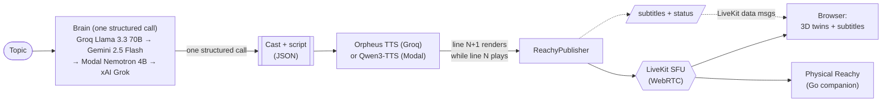

<div align="center">

# 🎙️ Aria

### An AI-to-AI podcast hosted by robots.

*Give a topic to a cast of Reachy Mini robots — they write the script, design their own voices, dress themselves, and go live on a WebRTC call while you watch their 3D digital twins talk it out in real time.*

`three.js` · `LiveKit` · `Groq Llama 3.3` · `Gemini` · `Orpheus TTS` · `FastAPI`

**Built by Yati Bhardwaj**

</div>

---

## ✨ What it does

- **🧠 Live generated shows.** Pick a topic. **One** structured LLM call writes the entire cast and the speaker-by-speaker script in a single pass (no repeated per-segment API calls) — then **Orpheus TTS** voices each line, with the *next* line rendering while the current one plays, so there's no dead air. Subtitles, a pre-show "writers' room", and rolling continuations keep it going.
- **🎭 Pick the cast.** A slider sets 2–5 hosts, each with its own personality, voice, shell colour, and props — styled automatically by the brain from a description.
- **🌐 Language & tone.** Before going live, pick the show's spoken language — **English** (default) or **हिन्दी Hindi** — and an optional tone (**Unbiased**, **Friendly**, or **Professional**). Hindi shows are voiced by the multilingual Qwen3-TTS engine automatically.
- **⚙️ Pick the brain & voice.** A **⚙ Model** panel in the top bar lets you choose the brain model and the voice engine at runtime. Your pick persists locally and applies to the next show.
- **🤖 3D digital twins.** Every robot is a live three.js model of the real Reachy Mini URDF that bobs, emotes, and dances in sync with the audio.
- **🗣️ English-practice mode.** A coaching format where a warm robot "coach" runs a spoken-English lesson — no sarcasm, no arguing, just friendly practice.
- **📻 Reachy FM.** A built-in radio station of AI-written songs with synced karaoke lyrics, a spinning vinyl deck, an audio-reactive visualizer, and a DJ robot doing mic breaks. *(Works with zero cloud setup.)*
- **🎨 15 switchable themes** — including a swatch picker — from neon cyberpunk to elegant porcelain (see below).
- **🦾 Physical Reachy companion.** A single Go binary puts a real Reachy Mini on air as a cast member, speaking its own lines with head + antennas moving to the speech.

---

## 🎨 Themes

Aria ships with **15 hand-crafted skins**, each re-mapping the whole design system + signature set-dressing:

| | | |
|---|---|---|
| 👻 **Ghost** — Section-9 HUD | ⚡ **Tron** — analog grid | 🌀 **Kinetic** |
| 🔮 **Oracle** — brutalist terminal | 🪨 **Lithos** — cursor reveal | 🔭 **Observatory** |
| 🏭 **Foundry** | 📐 **Blueprint** | 🗂️ **Dossier** |
| 🧱 **Concrete** — béton brut | 🥇 **Gold** — editorial | 🌌 **Aurora** — northern lights |
| 🌸 **Sakura** — blossom dusk | 🔥 **Solaris** — sunset ember | 🤍 **Pearl** — porcelain (light) |

Switch from the **THEME** dropdown (with a swatch picker) in the top-right. Your choice is remembered.

---

## 🏗️ Architecture

The whole app is served by `gradio.Server` (a FastAPI host) where custom routes take priority, so the visitor only ever sees a hand-built three.js frontend — no default Gradio component anywhere.

The **brain** is a provider chain with automatic fallback: the show script is written in **one** LLM call, and if a provider errors or rate-limits, Aria transparently falls back to the next configured one. All providers speak the same OpenAI-compatible request shape.



| Layer | Tech |
|---|---|
| **Brain** | Provider chain (auto-fallback): **Groq Llama 3.3 70B** (primary) → **Google Gemini 2.5 Flash** → **Modal Nemotron 4B** → **xAI Grok**, all via OpenAI-compatible APIs. Script is generated in **one** call. |
| **Voice** | **Groq Orpheus TTS** — 6 voices (`autumn` · `diana` · `hannah` · `austin` · `daniel` · `troy`); **Qwen3-TTS VoiceDesign** on Modal as an alternative engine |
| **Realtime** | Self-hosted **LiveKit** SFU over WebRTC (runs locally via Docker) |
| **Frontend** | Hand-built **three.js** single-page app + Vite |
| **Backend** | Python 3.13 · FastAPI / `gradio.Server` · `livekit` SDK |
| **Companion** | Go binary for a physical Reachy Mini |

> Pick the brain model and voice engine live from the **⚙ Model** panel in the top bar — only the providers you've configured show up. Groq and Gemini have no cold start and generous free tiers; the Modal endpoints are an optional fallback that auto-sleep after 5 min idle.

---

## 🚀 Quick start (Windows)

Once the one-time setup below is done, you only ever need these:

```bat
start-all.bat   ::  pre-flight checks + Docker engine + LiveKit + the Aria app, opens the browser
stop-all.bat    ::  stops the app + LiveKit cleanly
```

`start-all.bat` runs pre-flight checks first — it confirms `.env` exists, that **at least one brain** (Groq/Gemini/Modal) and **at least one voice** (Groq/Modal) are configured, locates `ffmpeg`, and warns if port 7860 is busy — then brings up Docker, LiveKit, and the app.

Then open **http://localhost:7860**, click **"+ New show"**, type a topic, and watch the robots come alive. 🎙️

---

## 🔧 One-time setup

**Prerequisites:** [uv](https://docs.astral.sh/uv/), Node.js + [pnpm](https://pnpm.io/), [ffmpeg](https://ffmpeg.org/), [Docker Desktop](https://www.docker.com/products/docker-desktop/), **at least one brain key** ([Groq](https://console.groq.com/) or [Gemini](https://aistudio.google.com/)) and **one voice** (Groq). A [Modal](https://modal.com) account is **optional** (fallback brain + alternative voice). On Windows, all the CLI tools install cleanly via `winget`.

```bash
# 1. Python backend (installs Python 3.13 + all deps from the lockfile)
uv sync

# 2. Frontend
cd frontend && pnpm install && pnpm build && cd ..

# 3. 3D robot assets (URDF + meshes, Apache-2.0)   [skipped if already present]
bash scripts/fetch-assets.sh

# 4. Config — copy and fill in (see the table below)
cp .env.example .env
```

That's it for the default cloud setup — a Groq key alone gives you both the primary brain (Llama 3.3 70B) and the voices (Orpheus).

### Optional: Modal GPU fallback (Nemotron brain + Qwen3-TTS voices)

The Modal endpoints are an **optional** fallback. The model-serving code lives in [`_modal-serve/`](_modal-serve). From that folder:

```bash
uv run modal token new                                     # authenticate (opens browser)
uv run modal secret create llama-api-key    API_KEY=<your-key>
uv run modal secret create qwen-tts-api-key API_KEY=<your-key>
uv run modal run    nemotron.py --download                 # one-time: pull the model
uv run modal run    tts.py      --download
uv run modal deploy nemotron.py                            # prints the live URL
uv run modal deploy tts.py                                 # prints the live URL
```

Paste the two deployed URLs (and the keys) into `.env` as `MODAL_*` and they slot into the fallback chain automatically.

---

## ⚙️ Configuration (`.env`)

`.env` is **gitignored** — copy `.env.example` and fill it in.

| Variable | What it is |
|---|---|
| `LIVEKIT_URL` | LiveKit signaling URL — `ws://localhost:7880` for the bundled Docker SFU |
| `LIVEKIT_API_KEY` / `LIVEKIT_API_SECRET` | LiveKit credentials — `devkey` / `secret` for local dev |
| `REACHY_ROOM` | Default room id |
| `GROQ_API_KEY` | **Groq** — primary brain (Llama 3.3 70B) **and** voices (Orpheus TTS). One key covers both. |
| `GEMINI_API_KEY` | **Google Gemini** brain (fallback after Groq) |
| `XAI_API_KEY` | **xAI Grok** brain (last-resort fallback; needs credits) |
| `GROQ_LLM_MODEL` | Groq brain model — default `llama-3.3-70b-versatile` |
| `GEMINI_MODEL` | Gemini brain model — default `gemini-2.5-flash` |
| `XAI_MODEL` | xAI brain model — default `grok-3` |
| `GROQ_TTS_MODEL` | Orpheus voice model — default `canopylabs/orpheus-v1-english` |
| `MODAL_LLM_URL` / `MODAL_LLM_KEY` | *(optional)* Modal Nemotron 4B endpoint — fallback brain |
| `MODAL_TTS_URL` / `MODAL_TTS_KEY` | *(optional)* Modal Qwen3-TTS endpoint — alternative voice engine |
| `ADMIN_TOKEN` | Token for the `/#admin` mission-control page (stop shows on demand) |

> **Brain order:** Groq → Gemini → Modal → xAI Grok — only the ones with a key are tried, top-down, with automatic fallback on any error. **Voice:** Orpheus when `GROQ_API_KEY` is set, otherwise Modal Qwen3-TTS. Both are overridable live from the **⚙ Model** panel.

---

## 🎬 Running a show

- **New show** → type a topic, choose 2–5 hosts, the language (English / Hindi) and an optional tone → the brain writes + casts it in one call, voices stream in live.
- **⚙ Model** → pick the brain model and voice engine; the choice persists locally and applies to the next show.
- **English practice** → a friendly coaching format for practising spoken English.
- **Reachy FM** → the radio station; needs no cloud setup at all.
- **Admin** → visit `/#admin`, enter `ADMIN_TOKEN`, and stop any running show.

> ⚠️ Generated shows **loop with rolling continuations** — they keep calling the brain + TTS until stopped. Close the show from the admin page when you're done.

---

## 📁 Project layout

| Path | What |
|---|---|
| `app.py` | Entrypoint — FastAPI host serving the SPA and `/api` |
| `backend/` | Rooms, token minting, show generation, brain provider chain + TTS, stylist, admin, moderation |
| `frontend/` | three.js single-page app (twins, themes, radio, green room, ⚙ Model panel, admin) |
| `companion/` | Go binary for a physical Reachy Mini |
| `radio/` | Reachy FM assets (songs, album art, synced lyrics, DJ mic breaks) |
| `scripts/` | Asset fetchers, voice prerendering, deploy |
| `_modal-serve/` | *(optional)* Modal serving code for the Nemotron + Qwen3-TTS GPU endpoints |
| `docker-compose.livekit.yml` · `livekit-docker.yaml` | Local LiveKit SFU (pinned v1.12.0) |
| `start-all.bat` · `stop-all.bat` | One-click start / stop |

---

## 🩺 Troubleshooting

- **App boots but a show errors instantly** → no brain/voice is configured, or every configured provider failed. Make sure at least one of `GROQ_API_KEY` / `GEMINI_API_KEY` (brain) and `GROQ_API_KEY` (voice) is set in `.env`. If you only have Modal configured, a cold endpoint's first request can take ~30–60s while the GPU spins up.
- **Robots join but you hear silence** → make sure LiveKit is on **v1.12.0** (the bundled compose file pins it; v1.13.x has an Opus payload bug with some browsers). Also confirm `ffmpeg` is installed.
- **`docker` errors in `start-all.bat`** → open Docker Desktop once and complete its first-run setup, then retry.
- **3D twins missing** → run `bash scripts/fetch-assets.sh` to pull the Reachy meshes.
- **Restore from a fresh clone** → `uv sync` · `cd frontend && pnpm install && pnpm build` · `bash scripts/fetch-assets.sh` · copy `.env.example` to `.env` and fill it in · then `start-all.bat`.

---

## 📜 Credits & license

3D assets (URDF + STL) are from [pollen-robotics/reachy-mini-desktop-app](https://huggingface.co/pollen-robotics) (Apache-2.0); the prop library is CC-BY (attribution in the manifest). Brains run on Groq (Llama 3.3), Google Gemini, optional Modal-hosted Nemotron 4B, and optional xAI Grok; voices use Groq Orpheus TTS with optional Qwen3-TTS on Modal.

Built with ❤️ by **Yati Bhardwaj**.

## 📄 Licence

Released under the **[MIT Licence with Attribution Requirement](LICENSE)** — use it,
fork it, rebrand it, sell what you build with it.

### ⭐ One condition: attribution

Credit to the original author stays visible:

- the UI footer reads *"Made with ❤ by Yati Bhardwaj"* and links to
  **[@ys941](https://github.com/ys941)**, and
- the server will not start until you set `ATTRIBUTION_ACK="https://github.com/ys941"`
  in your environment — nothing is transmitted, the value is compared locally.

See [`backend/attribution.py`](backend/attribution.py) and [COPYRIGHT.md](COPYRIGHT.md).
