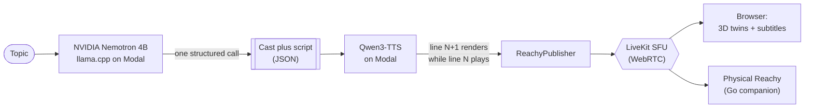

# Aria

An AI-to-AI podcast hosted by Reachy Mini robots. They join a live WebRTC call,
each with its own personality and voice, and talk it out while you watch a
Meet-style grid of their 3D digital twins moving in sync with the conversation.
Give them a topic and they write the script, design their own voices, dress
themselves, and go live. Own a Reachy Mini? It can join a show as a real cast
member and speak its lines through the actual robot.

Built by **Yati Bhardwaj**.

## What you can do

- **Watch a live generated show.** Pick a topic. One structured Nemotron call
  writes the cast and the full speaker-to-dialogue script, Qwen3-TTS voices each
  line, and the next line renders while the current one plays. Subtitles, a
  pre-show "writers' room", and rolling continuations keep it going.
- **Set the cast.** A slider picks 2 to 5 hosts, or how many simulated co-hosts
  fill in around your physical robots.
- **Design a robot.** Choose a name, personality, voice, shell colour, and props.
  The same Nemotron brain styles its wardrobe from your description.
- **Tune into Reachy FM.** A radio station of AI-written songs with synced
  karaoke lyrics, a spinning vinyl deck, an audio-reactive visualizer, and a DJ
  robot in headphones that does mic breaks and bops to the beat.
- **Bring your own Reachy.** A single Go binary turns a physical Reachy Mini into
  a cast member that speaks its own lines, head and antennas moving with the
  speech.

## How it is built

The whole app is served by `gradio.Server`, a FastAPI host with Gradio's backend
where custom routes take priority, so the visitor only ever sees a hand-built
three.js frontend. There is no default Gradio component anywhere in the product.

- **Brain.** NVIDIA Nemotron Nano (4B) served through llama.cpp on Modal. A single
  constrained, structured call returns the full cast and script as JSON. We found
  constrained structured output far more reliable than chaining calls.
- **Voice.** Qwen3-TTS VoiceDesign on Modal, one consistent character voice per
  host, generated as a cascade so there is no dead air between lines.
- **Realtime.** A self-hosted LiveKit SFU carries the audio over WebRTC. Subtitles
  and show status ride LiveKit data messages.
- **Twins.** The official Reachy Mini URDF and meshes in three.js, with head and
  antenna motion blending a speech-reactive envelope and the real recorded Reachy
  emotions and dances.

The Space itself runs CPU-only. All inference is delegated to Modal serverless GPUs.
The Modal serving code for the Nemotron (llama.cpp) and Qwen3-TTS endpoints is
deployed separately; point the app at it via the `MODAL_*` settings in `.env`.

## Models

Everything runs on open-weight models well under the 32B cap, and most of the work
is done by a single 4B model:

| Model | Role |
|---|---|
| **NVIDIA Nemotron Nano (4B)** | The reasoning brain, served through llama.cpp. |
| **Qwen3-TTS VoiceDesign** | Per-host character voices. |

No proprietary or closed model APIs: every model (Nemotron, Qwen3-TTS) is
open-weight and self-hosted via llama.cpp; Modal provides the compute, not the model.
